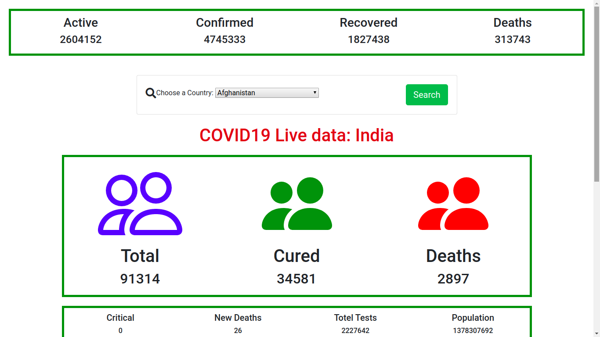
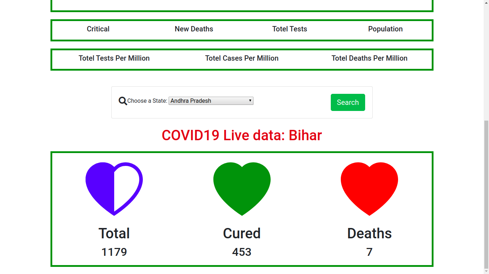

# Corona Virus-19 Case Tracker

## About

This application is developed in Python Flask (a web framework for rapid development).

  

  

## Add Features

## How to Use
https://thawing-shelf-97252.herokuapp.com/

## USAGE
   
    Python3, Flask, Covid, Covid-India.
   
## REQUIREMENT
 
### Environment:
  
    Source code to this project is coded in Python3, with its GUI running in Flask framework.
 
 
### Packages:

    pip3, flask, covid, covid-india

### Command Line Interface(CLI):
  
    Terminal
    cmd
 
 
## INSTALLATION 
 
   Use the package manager [pip](https://pip.pypa.io/en/stable/) to install packages set env for Python3.
 
### Packages :  

    $ pip install virtualenv 
    $ pip install python3.7 python-pip
    $ pip install covid
    $ pip install covid-india

### Setting up Flask framework for Python3 :

   	$ pip install flask
    $ pip install gunicorn
    
### Clone repository :

    https://github.com/RadheTians/Covid_19_Case_Tracker.git
    cd Covid_19_Case_Tracker
    
### Running Locally
To run at localhost. It will run on port 5000 by default.

    $ python app.py
    
To access this project go to any browser and type in url http://127.0.0.1:5000/

## Credits

### Project Credit
  * [Abhijeet Vatsha ](https://www.linkedin.com/in/abhijeet-vatsha-7b509715b/)

### Data Credit
  * [Worldometers](https://www.worldometers.info/coronavirus/)
